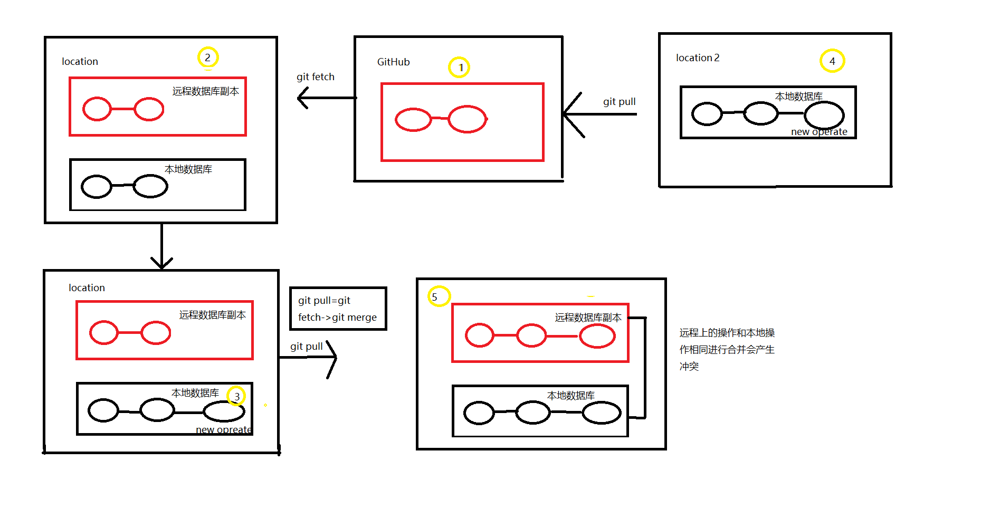
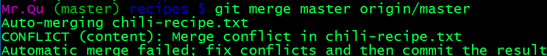
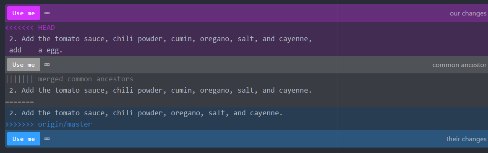

git init git 初始化

git status 查询状态

git log 查看日志

git add 添加文件到暂存区

git commit 提交在暂存区的文件

git diff xxx xxx 比较文件

git branch 查看分支
<!--more-->
git branch xxx 创建新的分支

git checkout xx 切换分支

git checkout -b xxx 创建新的分支并切换

git merge master test 合并两个分支（当分支同一级都做了修改，合并的时候会出现冲突，具体参考下面的冲突）

git show id 显示父级跟系版本的改动

git branch -d test 删除分支

merge conflict

HEAD标记表示我的代码
中间部分是已修改的原始版本
底部标记的分支是表示该分支的代码

方法：删除原始数据和不需要的留下来的代码，保留需要的代码

git remote 查看远程库和创建远程数据库

git remote add 名称 远程数据库地址

git remote -v 显示详细的信息

git push 名称 分支 推送到github

git pull 名称 分支 github上拉取

GitHub 上fork 是获取其他人的库，并不需要先clone本地然后在上传 fork显示其他人获取的数量
git fetch 更新远程分支的本地副本而实际的本地版本保持不变

情景：在获取远程库副本到本地，进行操作的时候 git pull 相当等于git fetch 更新然后 git merge 进行合并
自己画图梳理了一下。

git merge master origin/master 合并本地数据库和远程数据库副本
解读完上述信息，合并保留需要的删除其他两个->git add 文件->git commit；