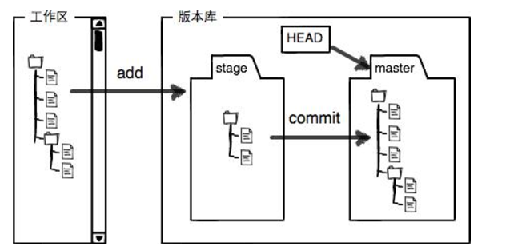
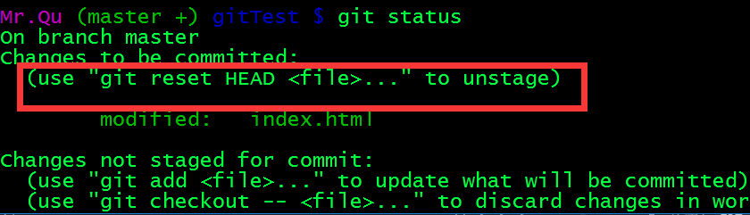

> 再次学习 git 完善以前没有注意到的问题，主要学习廖雪峰的git教程，基本命令在前面已经总结，但是具体的实际开发过程中需要注意的场景将重新总结。希望学习的可以访问原网站，一下是自己的总结，方便以后个人查询

## Git工作区，暂存区与版本库


git add: 将文件从工作区添加到暂存区
git commit: 将暂存区存储到版本库
<!--more-->
## 版本回退
> 当我们 commit 很多操作的情况系，我们想要回到之前的版本，可以通过版本回退，回退到之前的版本,如果忘了如何操作我们可以查询当前状态，根据提示操作 git status(git status 是查询工作区的状态)

### Code block
``` 
git reset --hard HEAD^(回退到上一个提交版本 HEAD~回退的次数)
git reset --hard commit_ID(回退到固定id的版本)
```


>以上可能需要 git log 查询提交ID，其中在命令后面添加 –pretty=oneline 表示只显示ID 和提交的消息

总结：

HEAD 指向的版本问当前版本所以后面一个^表示向前跳转一个~+数字表示向前跳几个
如果在回退到之前的版本忘记了commit_ID可以通过
git reglog查询记录所有的操作

### 管理修改
>场景1：当我们在工作区修改了一些内容，想要回到以前的版本中

方法1: 手动删除不需要的内容
方法2: git chectout –filename 可以丢弃工作区的内容
>场景2 :当我们不想要的修改已经提交到了暂存区内,并且又在工作区修改的一些内容，该如何恢复？

方法: git reset HEAD filename这个命令在git status后也可看到该提示。如下图:
将文件从回退到工作区。场景1的方法,将文件恢复到add前



>场景3 :当我们不想要的修改提交到了版本库，该如何恢复？

方法: 先reset 回退到前一个版本库。就OK啦

##删除操作

>当我们在完成了提交版本库的操作，删除了在工作区的一个文件，第一种场景是我们确实要删除它，那就add ——> commit 完成更新版本库。第二种是，我们误删了文件想要恢复它。

方法：git checkout –filename

#### 总结：git checkout 其实是用版本库里的版本替换工作区的版本，无论是修改还是删除,都可以“一键还原”
>注意：git rm用于删除一个文件。如果这个文件已经提交到了版本库，那就不用担心误删，但是你只能恢复文件到最新版本，你会丢失最近一次提交后你修改的内容
